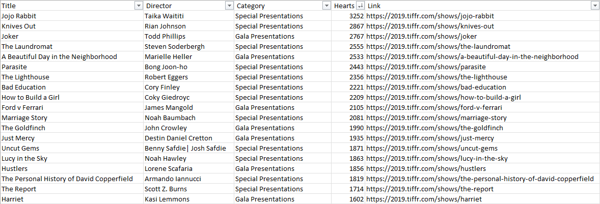

# TIFF-2019

Movie_Grabber.py extracts film information from https://2019.tiffr.com using `bs4` to build the variables 'Title', 'Director', 'Category', 'Link', and the metric 'Heart' to gauge the popularity of the title. A comma separated file 'movies.csv' is exported which can then be explored in any spreadsheet software.

'Text_Notification.py' takes a list of films and sends a text message using `twilio` when tickets become available for the title.

### Spreadsheet Sample

Without this application, I would not have bought tickets for Jojo Rabbit, Knives Out, Parasite or The Lighthouse, which turned out to be great films at the festival.